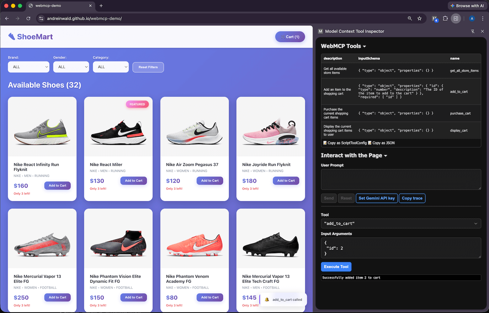

# WebMCP Demo
https://andreinwald.github.io/webmcp-demo

Prerequisites:
- Google Chrome version 146 or higher
- Enable "WebMCP" in chrome://flags
- Browser extension to call actions [chromewebstore](https://chromewebstore.google.com/detail/model-context-tool-inspec/gbpdfapgefenggkahomfgkhfehlcenpd)

Actions registered in [WebMCP.ts](./src/WebMCP.ts)

Read more:
- https://developer.chrome.com/blog/webmcp-epp
- https://webmachinelearning.github.io/webmcp
